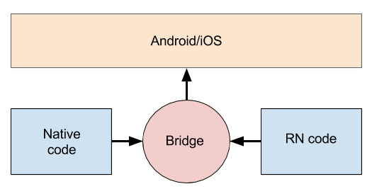

import { Head, Notes, Appear } from 'mdx-deck'
import Box from 'superbox'
export { theme } from './theme'
import { Logo, Image, Grid } from './src/components'

<Logo src="assets/images/logo.jpg" />
<Box fontSize={80} p={4}>React Native</Box>
<Box fontSize={16}>João Pedro Bretanha - Tech Lead</Box>

---

<Box fontSize={60}>Por que usar</Box>
<ul>
  <Appear>
    <li>Agilidade no desenvolvimento</li>
    <li>React</li>
    <li>JS</li>
  </Appear>
</ul>

---

<Box fontSize={60}>Como funciona</Box>

---

<Box fontSize={60}>Quem usa</Box>
<Appear>
  <Image 
    width={100}
    height={100}
    src="https://facebook.github.io/react-native/img/showcase/instagram.png"
  />
  <Image
    width={100}
    height={100}
    src="https://facebook.github.io/react-native/img/showcase/pinterest.png"
  />
  <Image
    width={100}
    height={100}
    src="https://facebook.github.io/react-native/img/showcase/uber.png"
  />
  <Image
    width={100}
    height={100}
    src="https://facebook.github.io/react-native/img/showcase/discord.png"
  />
  <Image
    width={100}
    height={100}
    src="https://facebook.github.io/react-native/img/showcase/glitch.png"
  />
  <Image
    width={100}
    height={100}
    src="https://facebook.github.io/react-native/img/showcase/facebook.png"
  />
  <Image
    custom={`
      position: absolute;
      top: 50%;
      margin-top: -250px;
      left: 50%;
      margin-left: -250px;
    `} width={500} height={500} src="https://comicsandmemes.com/wp-content/uploads/surprise-pikachu-meme-000-original-blank.png" />
</Appear>

---

<Image width='720px' height='400px' src="https://cdn-images-1.medium.com/max/2600/1*fAiBQdraF2doJ7vc_eASBQ.jpeg" /> 

---

<Box fontSize={60}>Vantagens do Flutter sobre o RN</Box>

<ul>
  <Appear>
    <li>Boa documentação</li>
    <li>Performance</li>
    <li>Animações</li>
  </Appear>
</ul>

---

<Box fontSize={60}>Desvantagens do Flutter sobre o RN</Box>

<ul>
  <Appear>
    <li>DART</li>
    <li>Dificuldade de estilizar componentes   pois não existe o uso de JS/JSX</li>
    <li>Gerenciamento   complexo do ciclo de vida</li>
    <li>1 ano e meio de vida</li>
    <li>322 contribuidores (RN tem 1866)</li>
    <li>4k de issues abertas (RN tem 600)</li>
  </Appear>
</ul>

---

<Image width='720px' height='400px' src="https://appinventiv.com/blog/wp-content/uploads/2018/12/React-Native-vs-Native-App-Development.jpg" /> 

---

<Box fontSize={60}>Vantagens do RN</Box>

<ul>
  <Appear>
    <li>Rapidez no desenvolvimento</li>
    <li>Flexbox</li>
    <li>Componentes são renderizados nativamente</li>
  </Appear>
</ul>

---

<Box fontSize={60}>Dificuldades no  desenvolvimento com RN</Box>
<ul>
  <Appear>
    <li>Problemas na camada nativa</li>
    <li>Dependência de libs open source</li>
  </Appear>
</ul>

---

<Box fontSize={60}>React Native em 2019</Box>

---

<Box fontSize={60}>JavaScript Interface (JSI)</Box>
<Box fontSize={40}>Melhor comunicação entre o código JS com o código nativo</Box>

---

<Image width='720px' height='200px'src="https://blog.rocketseat.com.br/content/images/2019/02/jsi.png" />

---

<Box fontSize={60}>Nova arquitetura (Fabric)</Box>
<Image height='300px' width='600px' src='https://blog.rocketseat.com.br/content/images/2019/02/react-native-ui-architecture.png' />

---

<Box fontSize={60}>Valeu, flw!</Box>
<Box fontSize={40}>@jpbretanha</Box>
